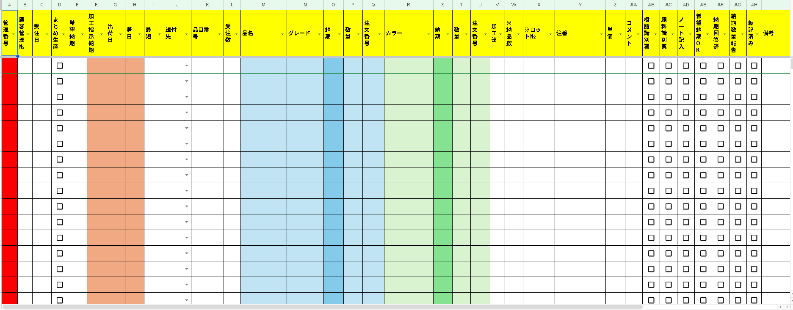
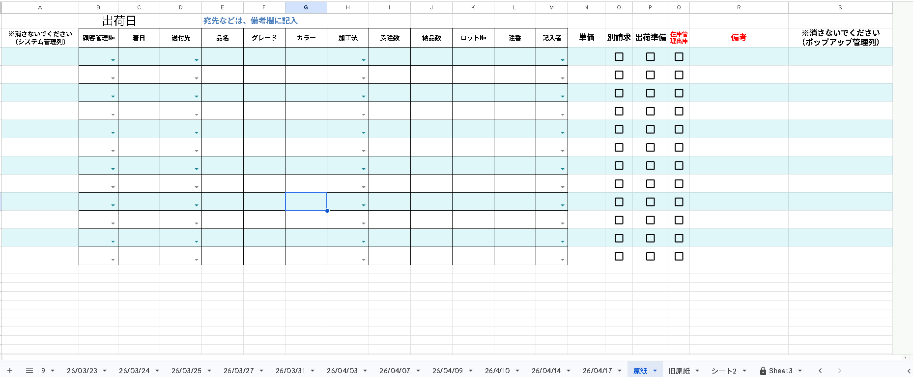

# 出荷管理システム（GAS）

Google Apps Script を利用して、**スプレッドシート上の出荷管理業務を自動化するシステム**です。  
入力用シートでチェックボックスを操作するだけで、出荷日ごとのシートへ自動転記し、シート生成・並べ替え・保護まで一連の処理を行います。

---

## Background

出荷管理をスプレッドシートで行う業務では、以下のような課題がありました。

- 手動での転記作業  
- 出荷日ごとのシート作成  
- 過去データの管理  
- 作業ミスや二重転記の発生  

こうした課題により、**ヒューマンエラーの増加**や**作業時間の肥大化**が起きやすい状態でした。  
これらの業務を効率化し、より安定した運用を実現するために、本システムを開発しました。

---

## Solution

Google Apps Script を利用し、チェックボックス操作だけで出荷データを自動処理する仕組みを構築しました。

このシステムにより、以下を自動化しています。

- 出荷日シートへの自動転記  
- 出荷日シートの自動生成  
- 日付順でのシート並べ替え  
- 重複転記の防止  
- 過去シートの自動保護  

---

## System Architecture

```mermaid
flowchart TD
    A[入力用スプレッドシート<br>入力用シート]
    B[チェックボックス ON / OFF]
    C[onEditHandler]
    D[転記処理]
    E[削除処理]
    F[出荷管理スプレッドシート]
    G[出荷日シート自動生成]
    H[データ転記]
    I[シート並べ替え]
    J[protectPastSheets<br>時間主導トリガー]
    K[過去シート自動保護]

    A --> B
    B --> C
    C --> D
    C --> E
    D --> F
    E --> F
    F --> G
    F --> H
    F --> I
    J --> K
    K --> F

入力用スプレッドシート  
↓ チェックON / OFF  
onEditHandler（GAS）  
↓  
転記・削除処理  
↓  
出荷管理スプレッドシート  
↓  
出荷日シート自動生成  
↓  
データ転記  
↓  
シート並べ替え  
↓  
protectPastSheets（時間トリガー）  
↓  
過去シート自動ロック

---

## Screenshots

### 入力用シート



チェックボックスをONにすると出荷データが転記されます。

### 出荷日シート



出荷日ごとにシートが自動生成され、データが整理されます。

### システム図


---

## Key Features

- チェックボックス操作による自動転記  
- チェックOFFによる転記データの自動削除  
- 出荷日ごとのシート自動生成  
- 日付順の自動ソート  
- 重複データ防止  
- 過去シートの自動保護  
- 土日を考慮したロック判定  
- 特定列を除外したデータ有無判定  

---

## Tech Stack

- Google Apps Script  
- Google Spreadsheet  
- JavaScript  

---

## ファイル構成

入力用スプレッドシート（SRC）  
└ 入力用シート（チェックボックスで操作）

出荷管理スプレッドシート（DST）  
├ 原紙シート（新規シート作成時のテンプレート）  
├ 権限管理シート（管理者・担当者のメールアドレス管理）  
└ yy/MM/dd シート（出荷日ごとに自動生成）

---

## 機能一覧

| 機能 | 説明 |
|------|------|
| 自動転記 | チェックONで出荷日シートに転記 |
| 自動削除 | チェックOFFで転記データを削除 |
| シート自動生成 | 出荷日シートが無ければ原紙からコピーして作成 |
| シート並べ替え | 日付順に自動ソート |
| 自動ロック | 当日以前のシートを自動で保護 |
| 土日スキップ | 金曜日は翌営業日（月曜）基準でロック判定 |
| 重複チェック | 同一行の二重転記を防止 |
| 除外列対応 | 「別請求」「出荷準備」「在庫管理出庫」列は判定から除外 |

---

## セットアップ手順

### 1. スクリプトをコピーする

GASエディタに以下の関数をコピーします。

- onEditHandler
- sortSheetsByDate
- protectPastSheets
- setConfig（初回のみ使用・実行後削除）

---

### 2. スプレッドシートIDを登録する

setConfig 関数内の指定箇所に出荷管理スプレッドシートのIDを入力し、  
GASエディタで setConfig を実行します。

設定完了後は setConfig 関数を削除します。

スプレッドシートID確認方法

https://docs.google.com/spreadsheets/d/【ここがID】/edit

---

### 3. トリガーを設定する

| 関数 | トリガー種別 | 設定 |
|------|-------------|------|
| onEditHandler | スプレッドシート → 編集時 | - |
| protectPastSheets | 時間主導型 | 毎日・任意時刻 |

---

## シート設定

### 入力用シート（SRC）

| 列名 | 説明 |
|------|------|
| 転記済み | チェックボックス。ONで転記、OFFで削除 |
| 出荷日 | 出荷日（Date型） |
| その他 | 転記対象の項目 |

---

### 出荷日シート（DST）

- ヘッダーは **2行目**  
- データは **3行目以降**  
- **A列** に転記元の行番号を記録  
- ヘッダー名が一致する列へ自動マッピングして転記  

---

### 権限管理シート（DST）

| 列 | 内容 |
|----|------|
| A列 | メールアドレス |
| B列 | 役割（管理者 / 担当者） |

- 管理者：ロック後もシート全体編集可能  
- 担当者：K列・L列・P〜S列のみ編集可能  

---

## ロック仕様

### ロック対象

当日基準で **翌営業日より前のシート** を自動ロックします。

| 実行日 | ロック対象 |
|--------|-----------|
| 月〜木 | 翌日以前 |
| 金 | 翌月曜以前 |

---

### 編集可能範囲

| 権限 | 編集可能範囲 |
|------|-------------|
| 管理者 | シート全体 |
| 担当者 | K列・L列・P〜S列 |

---

## Technical Highlights

- onEditトリガーによるリアルタイム処理  
- ScriptProperties を用いた設定管理  
- ヘッダー名一致による動的列マッピング  
- 転記元行番号による重複防止  
- 時間主導トリガーによる自動シート保護  

---

## 注意事項

- 土日の出荷日は設定しない運用を前提としています  
- setConfig 実行後は必ず関数を削除してください  
- スクリプトは **入力用スプレッドシート（SRC）** に設置します  
- スプレッドシートIDは機密情報のため README に記載しないでください